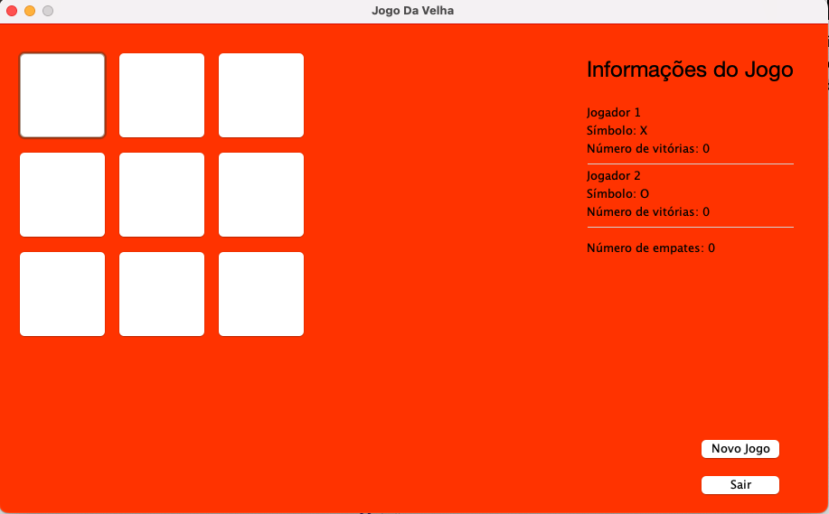

<h1 align="center" id="title">Jogo da Velha em Java</h1>

Desenvolvi um jogo de velha em Java utilizando JFrame para criar a interface gráfica do jogo. A interface oferece opções para iniciar um novo jogo e sair além de permitir a participação de dois jogadores (Jogador 1 e Jogador 2). Ambos os jogadores podem fazer suas jogadas e o jogo pode ser concluído com uma vitória de um dos jogadores ou com um empate.

<h2>Project Screenshots:</h2>

  
  
<h2>💻 Built with</h2>

Technologies used in the project:

*   Java
*   NetBrans IDE
*   JFrame
